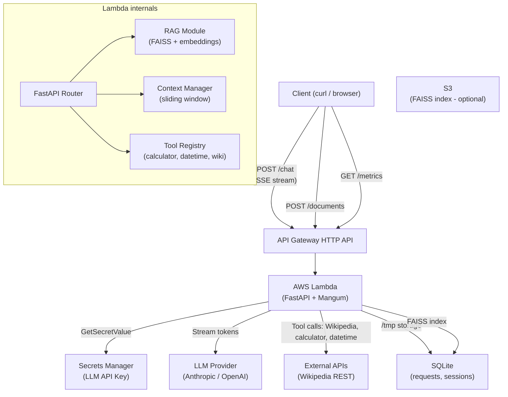

# Architecture: Full AI Assistant

## Data flow for a /chat request

1. Client sends `{"message": "...", "session_id": "abc"}`
2. Lambda loads last 20 messages for session "abc" from SQLite
3. RAG retrieves top-3 chunks from FAISS index (if use_rag=true)
4. Context manager checks token count, applies sliding window if needed
5. LLM streams response; if tool_call in response → execute tool → inject result → continue
6. Final answer streamed as SSE to client
7. Request logged to SQLite (tokens, cost, latency, retrieval_hit)
