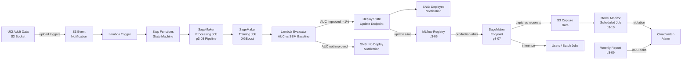

# Architecture — Path 3 MLOps System

## Component Map

## Data Flow

1. **Training trigger:** New data uploaded to S3 → S3 notification → Lambda → Step Functions execution
2. **Preprocessing:** SageMaker Processing Job applies the sklearn pipeline (p3-03)
3. **Training:** SageMaker Training Job on preprocessed data → model artifact to S3
4. **Evaluation:** Lambda reads new AUC from CloudWatch, compares to SSM baseline
5. **Conditional deploy:** If AUC improves > 1%, update endpoint; else notify and skip
6. **Monitoring:** Model Monitor captures requests, computes drift vs training baseline, fires alarm
7. **Reporting:** Weekly report (p3-09) computes live accuracy vs MLflow baseline, surfaces delta

## Component Registry

| Component | Project | AWS Service | Resource Name |
|---|---|---|---|
| Real-time endpoint | p3-07 | SageMaker Endpoint | p3-07-adult-income-endpoint |
| Monitoring schedule | p3-10 | SageMaker Model Monitor | p3-10-hourly-monitor |
| Retraining pipeline | p3-11 | Step Functions | p3-11-ml-pipeline |
| Evaluator Lambda | p3-11 | Lambda | p3-11-evaluate-and-deploy |
| Experiment registry | p3-05 | MLflow (local) | adult-income-xgboost |
